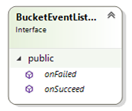

# Fresh Fruit

## Description
Program Fresh Fruit ini bertujuan untuk menambahkan item ke sebuah keranjang digital dan menghapus item dari keranjang.

## Scope of Functions
Berikut beberapa fungsi dari projek ini :
## Menambahkan barang sampai 4 buah
- Penambahan fungsi delete pada program.
- Penambahan messagebox pada saat menambahkan dan menghapus.
- Ditambahkan messagebox image warning dan information.
- ## TUGAS
1. Apa fungsi dari BucketEventListener ?
2. Buatlah class Diagramnya !
3. Berilah pembahasan alur atau logika pemrogramannya !
## JAWABAN
1. Fungsi dari BucketEventListener adalah Sebagai tempat untuk handle event ketika action dijalankan berhasil `(void onSucceed)` atau gagal `(void onFailed)`.

2. 
3. Pembahasan Alur
   - Membuat program keranjng buah yang bisa menmbahkan atau mengurangi buah yang di inginkan dan ada maksimal item yang dapat dimasukkan kedalam keranjang
   - Pertama membuat assets, yaitu berisikan daftar buah yang diinginkan, ada anggur, pisang, jeruk daan apel
   - Lalu membuat model, yaitu berisikan bucket atau keranjang untuk menambah buah, bucketeventlistener sebagai method agar buah berhasil ditambahkan atau dikurangi, lalu fruit untuk pemanggilan buah, lalu seller sebagai tempat penjualan buahnya.
   - Setelah itu membuaat controller, yaitu bucket controller untuk mengatur keranjang buah yang sudah berisi buah. Jika keranjang penuh maka akan keluar tulisan ups keranjang penuh
   - Lalu main window, berisikan coding dari semua item diatas dan juga berapa output layar dalam berbelanja buah. Menampilkan informasi buah apa saja yang dibeli, berapa jumlah maksimal buah, dan dapat mengurai buah dari keranjang. 

Pembahasan logika pemrogramannya logika yg terdapat pada aplikasiini adalah untuk memasukan buah ke keranjang dan misal kalo keranjang penuh akan ada pemberitahuan keranjang penuh. syntax nya
 ``` C#
 class BucketController
    {
        private Bucket bucket;
        private BucketEventListener eventListener;

        public BucketController(Bucket bucket, BucketEventListener eventListener)
        {
            this.bucket = bucket;
            this.eventListener = eventListener;
        }

        public void addFruit(Fruit fruit)
        {
            if(bucketIsOverload())
            {
                eventListener.onvailed("Ops, keranjang penuh");
            }
            else
            {
                this.bucket.insert(fruit);
                eventListener.onsucceed("Yeyy!!, berhasil ditambhkan");
            }
        }

        public bool bucketIsOverload()
        {
            return bucket.countItems() >= bucket.getCapacity();
        }

        public void removeFruit(Fruit fruit)
        {
            for(int itemPosition = 0; itemPosition < bucket.countItems(); itemPosition++)
            {
                if(bucket.findAll().ElementAt(itemPosition).getName() == fruit.getName())
                {
                    bucket.remove(itemPosition);
                    eventListener.onsucceed("Yeyy!!, berhasil dihapus");
                }
            }
        }
        public List<Fruit> findAll()
        {
            return this.bucket.findAll();
        }
    }
}
```


## La Ode Muhamad Laskar Jihad 19.11.2817